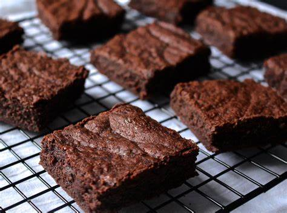
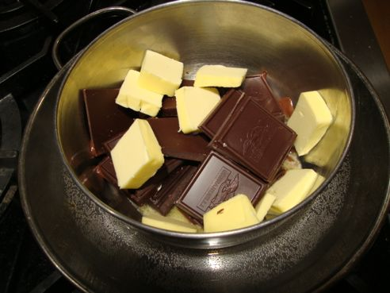
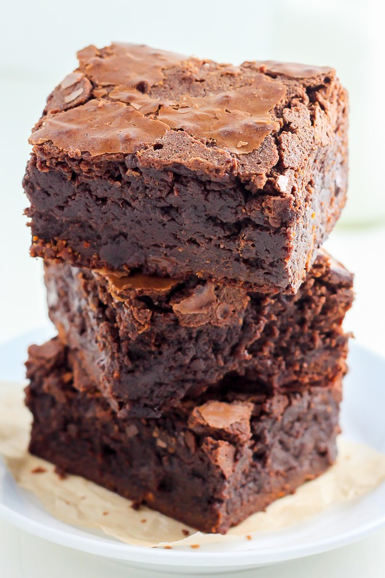

# How to Make Brownies

Quick and easy fudgy brownies that can be made for when guests are over or even just to satisfy your cravings. 

_________________________________________________________________________________________________________
Prep time: 15 minutes

Bake time: 20 minutes

Total: 35 minutes

Serving size: 20 bars
_________________________________________________________________________________________________________

## WARNING!
Since oven is being used, be careful, and make sure to wear oven mits.

## What you will need

-8 (1-ounce) squares of unsweetened chocolate

-1 cup butter

-5 eggs

-3 cups of sugar

-1 tablespoon vanilla

-1 1/2 cups flour

-1 teaspoon salt

-2 1/2 cups chopped pecans or walnuts (lightly toasted)

## Directions

Step 1: Grease the 13x9 pan and preheat the oven. Preheat your oven to 350 F or 325 F for dark metal and/or glass pans.

Step 2: Melt the chocolate

     - The next step is to melt 8 ounces of unsweetened chocolate and 1 cup of butter in a medium-sized, heat-safe bowl over a saucepan that has about 1 to 2-inches of water, over low heat.

     - Once combined, remove the chocolate mixture from the stove and set aside to cool.

Step 3: Toast the Nuts

     - In a toaster, put 2 1/2 cups of chopped walnuts in a foil-lined baking pan and set it for medium.
     
     - Nuts can also be toasted on stovetop or microwave.
     
     - 

Step 4: Beat the eggs and mix in the flour
     
     - In a mixing bowl, add 5 eggs, 3 cups of sugar, and 1 tablespoon of vanilla and cream together. Mix for 10 minutes.
     
     - Once you have beaten the eggs, in a separate bowl, whisk together 1 1/2 cups flour and 1 teaspoon of salt.

Step 5: Add Chocolate

     - Between mixing, gradually add the cooled chocolate mixture to the egg mixture

Step 6: Add flour and Nuts

     - While mixing, gradually add flour
     
     - Mix in the nuts

Step 7: Bake the brownies

     - Place mixture into pan for baking.
     
     - Bake for 35 to 40 minutes
     
     - Make sure to not overbake
     
Step 8: Completely let the brownies cool on a rack after removing from the oven, and then cut the squares.

   

